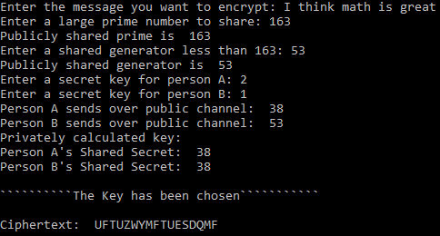

# Diffie-Hellman-Public-Key-Exchange
The Diffie-Hellman public key exchange is a method to securely exchenge a key so that the key can be used to encrypt messages. 
## Background 
There are methods of encryption where the sender and receiver must share a secret key. For instance, in the Hill cipher, both parties must agree on the key matrix and therefore must have a trusted courier to ensure the security of exchanging the key. In the event that the key falls into an eavesdropper's hands, the cipher will be accessible to the eavesdropper as to the recipient. Getting the key safely from the sender to the receiver is of paramount importance. As computers were becoming powerful between 1960s and 1970s, millions of businesses relied on encryption as far as transactions were concerned. Whitfield Diffie, who graduated from MIT in 1965, was one of the first people to come up with a successful strategy to tackle the problem of secure key exchange. He met Martin Hellman in the early 1970s, who worked in the Electrical Engineering department at Stanford University. After two of them started working on this problem together, in May of 1975 Diffie came up with an idea of splitting the key.
## Computation
First, a large prime number p is chosen. Then, a generator g is chosen such that . Both persons, say A and B, can publicly announce p and g, so a generator and a prime is a publically shared information. Then, each person secretly picks a number of their own. Say person A chooses a random integer r and keeps it a secret because it will be a private key. Person B chooses a random integer t, which will be a private key of their own. Now both parties compute X =  and Y =  respectively. After that, they exchange the values they got after computing X and Y. Now person A knows the value of Y and person B knows the value of X. Now each of them takes the value they got from another party and raise it to the power of their secret key. As a result, A computes K =  and B computes K = . Thus, person A and B end up with the same value for K and can use that as their key. 
## Caesar Cipher
A special case of a substitution cipher is the Ceasar cipher. Substitution ciphers are ciphers in which each letter of the alphabet is substituted by another letter. In the Ceasar cipher, the alphabet is shifted by a certain number that is identified by the chosen key. Each letter is assigned a number in the following fashion: A->0, B->1,..., Z->25. As a case in point, if the alphabet is shifted by five places, letter A in the plaintext becomes F in the ciphertext. In this case, Julius Caesar's cipher can be expressed as y = x + 5 (mod 26).
## Sample Run
Here is how the program encrypts a message. 

Reference: 
Susan Loepp, and William K. Wootters. *Protecting Information: From Classic Error Correction to Quantum Cryptography*. Cambridge University Press, 2006.
